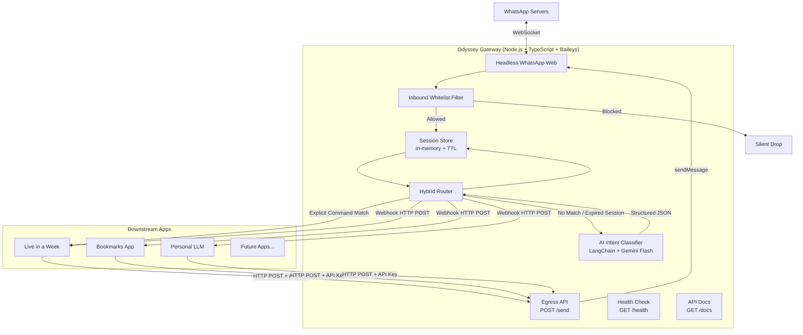

# Software Requirements Specification (SRS)
## Odyssey — Personal WhatsApp API Gateway

**Version:** 1.1  
**Date:** 2026-04-28  
**Author:** Kaushal Joshi  
**Status:** ✅ Final — All Items Resolved

---

## 1. Introduction

### 1.1 Purpose
This document specifies the software requirements for **Odyssey**, a personal WhatsApp gateway that acts as a unified, intelligent entry point for all personal applications that need WhatsApp-based interaction.

### 1.2 Project Scope
Odyssey is a **personal hobby project**. It is not intended for multi-tenant use or commercial scale. It runs as a single-instance Node.js/TypeScript service connected to one WhatsApp account via Baileys. It receives inbound WhatsApp messages, routes them to appropriate downstream applications, and provides an egress HTTP API for those apps to send WhatsApp messages back.

### 1.3 Why Baileys (not Meta Cloud API)
The official Meta WhatsApp Business API requires verified business registration, which is not applicable here. Baileys connects to WhatsApp Web via WebSocket and is sufficient for personal use.

### 1.4 Definitions & Acronyms

| Term | Meaning |
|---|---|
| Gateway | Odyssey itself |
| Downstream App | Any personal app registered in `config.json` |
| Explicit Command | A message starting with a known prefix (e.g. `/task`) |
| AI Router | LangChain-based intent classifier |
| Session | Per-user in-memory routing context with TTL |
| Egress API | The `POST /send` HTTP endpoint |
| JID | WhatsApp's internal user identifier (e.g. `919876543210@s.whatsapp.net`) |

---

## 2. System Overview

Odyssey sits between **WhatsApp** and a set of **downstream personal apps**. It has two traffic directions:

- **Ingress:** WhatsApp message → Odyssey → downstream app webhook
- **Egress:** Downstream app → `POST /send` → Odyssey → WhatsApp message to user



---

## 3. Current State of Downstream Apps

| App | Status | Interface |
|---|---|---|
| Live in a Week | ✅ Live | Web UI (browser extension) + WhatsApp |
| Bookmarks | 🔲 Planned | TBD |
| Personal LLM | 🔲 Planned | WhatsApp only |
| Future apps | 🔲 TBD | TBD |

Odyssey must allow new apps to be registered with **zero code changes** — only a `config.json` update.

---

## 4. Functional Requirements

### 4.1 WhatsApp Connection (Baileys)

| ID | Requirement |
|---|---|
| F-CONN-01 | The system SHALL connect to WhatsApp using Baileys over WebSocket. |
| F-CONN-02 | On first launch, the system SHALL display a QR code in the terminal for account linking. |
| F-CONN-03 | The session SHALL be persisted to a configurable directory (default: `auth_info_baileys/`), mapped to a Railway Volume. |
| F-CONN-04 | On an unexpected disconnection, the system SHALL automatically attempt to reconnect. |
| F-CONN-05 | On a `DisconnectReason.loggedOut` event, the system SHALL NOT auto-reconnect. |

### 4.2 Inbound Message Processing

| ID | Requirement |
|---|---|
| F-IN-01 | The system SHALL listen for all incoming WhatsApp messages of type `notify`. |
| F-IN-02 | The system SHALL ignore messages sent by the bot itself (`fromMe: true`). |
| F-IN-03 | The system SHALL extract message text from `conversation`, `extendedTextMessage.text`, or `imageMessage.caption`. |
| F-IN-04 | The system SHALL silently drop messages from senders not present in the configured whitelist. |
| F-IN-05 | The sender phone number SHALL be normalized to a plain number string (no `@s.whatsapp.net`, no `+`). |

### 4.3 Inbound Whitelist

| ID | Requirement |
|---|---|
| F-WL-01 | Allowed phone numbers SHALL be configurable via the `ALLOWED_NUMBERS` environment variable as a comma-separated list. |
| F-WL-02 | If `ALLOWED_NUMBERS` is empty or unset, the system SHALL deny all inbound messages as a safe default. |
| F-WL-03 | Numbers SHALL be stored without `+` prefix (e.g. `919876543210`). |

### 4.4 Hybrid Message Router

#### 4.4.1 Explicit Command Router (Fast Path)

| ID | Requirement |
|---|---|
| F-RT-01 | The system SHALL check the message text for known command prefixes defined in `config.json > explicit_commands`. |
| F-RT-02 | Prefix matching SHALL be **case-insensitive** (`/Task` = `/task`). |
| F-RT-03 | On a match, the system SHALL forward the message **without** invoking the AI classifier. |
| F-RT-04 | A matched explicit command SHALL update the user's session to the target app. |
| F-RT-05 | The explicit command list SHALL be runtime-configurable via `config.json` — no code changes needed. |

#### 4.4.2 Session-Based Routing (Continuation Fast Path)

| ID | Requirement |
|---|---|
| F-SES-01 | The system SHALL maintain a per-user in-memory session store keyed by normalized phone number. |
| F-SES-02 | A session SHALL record: `lastApp` (app key string), `lastMessageAt` (Unix timestamp). |
| F-SES-03 | If a user has an active session (within TTL) and sends a non-command natural language message, the system SHALL route directly to `lastApp` without invoking the AI. |
| F-SES-04 | Session TTL SHALL default to **5 minutes**, configurable via `SESSION_TTL_MINUTES`. |
| F-SES-05 | Sessions SHALL be in-memory only and reset on server restart. This is acceptable. |
| F-SES-06 | **Session switching is implicit:** Sending an explicit command always overrides the current session. If the AI classifies a message with high confidence to a *different* app than the current session, the session SHALL be updated to the new app. |

#### 4.4.3 AI Intent Classifier (Fallback Path)

| ID | Requirement |
|---|---|
| F-AI-01 | If no explicit command matches and no active session exists, the system SHALL invoke the AI classifier. |
| F-AI-02 | The classifier SHALL use **LangChain** with **Gemini Flash**. LangGraph is explicitly out of scope. |
| F-AI-03 | The classifier SHALL output a structured, typed JSON object (validated with Zod at runtime): |

```typescript
interface ClassificationResult {
  intent: string;       // e.g. "create_task", "save_link"
  app: string;          // must match a key in config.json > apps
  confidence: number;   // 0.0 – 1.0
  raw_text: string;
  entities: Record<string, string>; // e.g. { task: "buy milk", due_date: "2026-04-29" }
}
```

| ID | Requirement |
|---|---|
| F-AI-04 | The `app` field SHALL map to a key in `config.json > apps`. |
| F-AI-05 | If confidence is below threshold (default `0.6`), the system SHALL first attempt to answer using Gemini's own capabilities. If it cannot provide a useful answer, it SHALL reply to the user: *"I didn't quite understand that. Try a command like `/task` or `/link`."* |
| F-AI-06 | The AI system prompt SHALL include each app's `description` from `config.json` to guide routing. |
| F-AI-07 | After AI classification, the session SHALL be updated with the resolved `app`. |

### 4.5 Webhook Forwarding

| ID | Requirement |
|---|---|
| F-WH-01 | The system SHALL forward the resolved payload to the target app's webhook URL via `HTTP POST`. |
| F-WH-02 | The forwarded payload SHALL conform to the standard `WebhookPayload` contract (see §7). |
| F-WH-03 | For explicit commands, `intent` SHALL be the matched prefix (e.g. `/task`) and `entities` SHALL be `{}`. |
| F-WH-04 | A non-2xx response from a downstream app SHALL be logged but SHALL NOT crash the gateway. |
| F-WH-05 | Webhook HTTP calls SHALL have a configurable timeout (default: 10 seconds). |

### 4.6 Egress API

| ID | Requirement |
|---|---|
| F-EG-01 | The system SHALL expose a `POST /send` HTTP endpoint. |
| F-EG-02 | Request body: `{ "to": "919876543210", "text": "Hello!" }` — **plain phone numbers only** (no JIDs). |
| F-EG-03 | The endpoint SHALL require an `x-api-key` header matching `GATEWAY_API_KEY`. |
| F-EG-04 | If WhatsApp is not connected, the endpoint SHALL return `503 Service Unavailable`. |
| F-EG-05 | On success, the endpoint SHALL return `{ "status": "sent" }`. |
| F-EG-06 | The gateway SHALL normalize the phone number to a JID internally before sending. |
| F-EG-07 | The egress API is a **dumb pipe** — no scheduling, queuing, or retry. Downstream apps own that logic. |

### 4.7 Health Check

| ID | Requirement |
|---|---|
| F-HC-01 | The system SHALL expose a `GET /health` endpoint, unauthenticated. |
| F-HC-02 | Response: `{ "status": "ok", "whatsapp": "connected" \| "disconnected" }` with HTTP `200`. |
| F-HC-03 | Railway SHALL be configured to use this endpoint for health checks and auto-restart. |

### 4.8 API Documentation (Swagger)

| ID | Requirement |
|---|---|
| F-DOCS-01 | The system SHALL expose a `GET /docs` endpoint serving a Swagger UI. |
| F-DOCS-02 | The OpenAPI spec SHALL document: `POST /send`, `GET /health`, and `GET /docs`. |
| F-DOCS-03 | Swagger SHALL be generated from code annotations (e.g. `swagger-jsdoc` + `swagger-ui-express`) — no separate spec file to maintain. |

---

## 5. Non-Functional Requirements

### 5.1 Language & Type Safety

| ID | Requirement |
|---|---|
| NF-TS-01 | The entire codebase SHALL be written in **TypeScript** with `strict: true`. |
| NF-TS-02 | All shared data structures (config, session, webhook payload, AI output) SHALL be defined as TypeScript interfaces/types in a `src/types/` directory. |
| NF-TS-03 | Runtime validation of external data (config.json, incoming webhook bodies, AI LLM output) SHALL use **Zod** schemas that are derived from the TypeScript types. |
| NF-TS-04 | There SHALL be no `any` types in production code. `unknown` with proper narrowing is acceptable. |

### 5.2 Code Quality & Comments

| ID | Requirement |
|---|---|
| NF-CQ-01 | Comments SHALL explain **why** a decision was made, not what the code does. Obvious code SHALL have no comment. |
| NF-CQ-02 | There SHALL be no commented-out code blocks in the committed codebase. |
| NF-CQ-03 | Module-level JSDoc is encouraged for non-obvious modules (e.g., the AI classifier, session store). |

### 5.3 Performance

| ID | Requirement |
|---|---|
| NF-PERF-01 | Explicit command routing SHALL complete within 200ms (excluding downstream network latency). |
| NF-PERF-02 | AI classification SHALL complete within 5 seconds under normal conditions. |

### 5.4 Reliability

| ID | Requirement |
|---|---|
| NF-REL-01 | The service SHALL auto-reconnect to WhatsApp on unexpected disconnections. |
| NF-REL-02 | Errors in the router or downstream webhook calls SHALL NOT crash the process. |
| NF-REL-03 | Railway SHALL auto-restart the container when the health check fails. |

### 5.5 Security

| ID | Requirement |
|---|---|
| NF-SEC-01 | All secrets SHALL be stored in environment variables. Never in source code or `config.json`. |
| NF-SEC-02 | The egress endpoint SHALL return `401 Unauthorized` for a missing or incorrect API key. |
| NF-SEC-03 | Inbound messages from non-whitelisted numbers SHALL be silently dropped. |
| NF-SEC-04 | `auth_info_baileys/` SHALL be in `.gitignore`. |

### 5.6 Maintainability

| ID | Requirement |
|---|---|
| NF-MAINT-01 | Adding a new downstream app SHALL require only a `config.json` update — no code changes. |
| NF-MAINT-02 | The project SHALL have a clear `README.md` covering: what Odyssey is, architecture overview, setup (local + Railway), environment variables, `config.json` schema, and how to add a new app. |
| NF-MAINT-03 | Code SHALL be organized in clearly separated modules: `src/router/`, `src/ai/`, `src/session/`, `src/api/`, `src/types/`. |

### 5.7 Deployability

| ID | Requirement |
|---|---|
| NF-DEP-01 | The service SHALL be deployable on **Railway** via a `Dockerfile`. |
| NF-DEP-02 | The `Dockerfile` SHALL use a multi-stage build: `builder` stage compiles TypeScript, `runtime` stage runs compiled JS only. |
| NF-DEP-03 | The `auth_info_baileys/` directory SHALL be mapped to a **Railway Volume** (persistent disk, ~$0/month at this scale) to survive redeploys. Mount path: `/app/auth_info_baileys`. |
| NF-DEP-04 | All configuration SHALL be injectable via Railway environment variables. |

---

## 6. Configuration Reference

### 6.1 Environment Variables

| Variable | Required | Default | Description |
|---|---|---|---|
| `PORT` | No | `3000` | Express server port |
| `GATEWAY_API_KEY` | Yes | — | API key for `POST /send` |
| `GEMINI_API_KEY` | Yes | — | Google Gemini API key for AI router |
| `ALLOWED_NUMBERS` | Yes | — | Comma-separated inbound whitelist (e.g. `919876543210,919123456789`) |
| `SESSION_TTL_MINUTES` | No | `5` | Per-user session expiry |
| `WEBHOOK_TIMEOUT_MS` | No | `10000` | HTTP timeout for downstream webhooks |
| `AI_CONFIDENCE_THRESHOLD` | No | `0.6` | Min confidence to commit AI routing result |

### 6.2 config.json Schema

```json
{
  "apps": {
    "live_in_a_week": {
      "webhook_url": "http://host.docker.internal:8001/webhook/whatsapp",
      "description": "Personal task manager and weekly planner"
    },
    "bookmarks": {
      "webhook_url": "http://host.docker.internal:8002/webhook",
      "description": "Save and retrieve web bookmarks and links"
    },
    "personal_llm": {
      "webhook_url": "http://host.docker.internal:8003/webhook",
      "description": "General purpose personal AI assistant for questions and conversation"
    }
  },
  "explicit_commands": {
    "/task": "live_in_a_week",
    "/today": "live_in_a_week",
    "/week": "live_in_a_week",
    "/done": "live_in_a_week",
    "/otp": "live_in_a_week",
    "/link": "bookmarks"
  }
}
```

> `description` values are injected into the AI classifier's system prompt. Keep them concise and distinct so the LLM can differentiate between apps.

### 6.3 TypeScript Types

```typescript
// src/types/config.ts
export interface AppConfig {
  webhook_url: string;
  description: string;
}

export interface OdysseyConfig {
  apps: Record<string, AppConfig>;
  explicit_commands: Record<string, string>;
}

// src/types/session.ts
export interface UserSession {
  lastApp: string;
  lastMessageAt: number; // Unix ms
}

// src/types/payload.ts
export interface WebhookPayload {
  from: string;
  raw_text: string;
  intent: string;
  app: string;
  entities: Record<string, string>;
  timestamp: string; // ISO 8601
}

// src/types/ai.ts
export interface ClassificationResult {
  intent: string;
  app: string;
  confidence: number;
  raw_text: string;
  entities: Record<string, string>;
}
```

---

## 7. Webhook Payload Contract

All downstream apps MUST accept `HTTP POST` at their registered webhook URL with a body conforming to `WebhookPayload`:

**AI-routed message:**
```json
{
  "from": "919876543210",
  "raw_text": "Remind me to buy milk tomorrow",
  "intent": "create_task",
  "app": "live_in_a_week",
  "entities": {
    "task": "buy milk",
    "due_date": "2026-04-29"
  },
  "timestamp": "2026-04-28T17:30:00.000Z"
}
```

**Explicit command:**
```json
{
  "from": "919876543210",
  "raw_text": "/task Buy milk",
  "intent": "/task",
  "app": "live_in_a_week",
  "entities": {},
  "timestamp": "2026-04-28T17:30:00.000Z"
}
```

---

## 8. Proposed Project Structure

```
odyssey/
├── src/
│   ├── types/          # Shared TypeScript interfaces (config, payload, session, ai)
│   ├── ai/             # LangChain classifier chain
│   ├── router/         # Hybrid router (explicit + session + AI)
│   ├── session/        # In-memory session store with TTL
│   ├── api/            # Express routes (/send, /health, /docs)
│   └── index.ts        # Entry point: Baileys init + Express server
├── config.json         # App registry and explicit commands
├── .env.example
├── Dockerfile          # Multi-stage build (builder + runtime)
├── docker-compose.yml
├── README.md
└── tsconfig.json
```

---

## 9. Implementation Milestones (Updated)

| # | Milestone | Description | Status |
|---|---|---|---|
| M1 | Scaffolding | Project structure, Docker, config | ✅ Done |
| M2 | TypeScript Migration | Convert to TS, add tsconfig, Zod schemas, types | ✅ Done |
| M3 | Baileys Core | Connection, QR, session persistence, message listener | ✅ Done |
| M4 | Inbound Whitelist | Filter by `ALLOWED_NUMBERS`, silent drop | ✅ Done |
| M5 | Explicit Command Router | Case-insensitive prefix fast-path | ✅ Done |
| M6 | Session Store | In-memory, TTL=5min, implicit session switching | ✅ Done |
| M7 | AI Classifier | LangChain + Gemini Flash, Zod-validated output | ✅ Done |
| M8 | Webhook Forwarder | HTTP POST with standard `WebhookPayload` | ✅ Done |
| M9 | Egress API | `POST /send` with API key, plain number input | ✅ Done |
| M10 | Health Check | `GET /health` for Railway monitoring | ✅ Done |
| M11 | Swagger Docs | `GET /docs` with `swagger-jsdoc` | ✅ Done |
| M12 | README | Setup, architecture, env vars, adding new apps | 🔲 Pending |
| M13 | Railway Deploy | Dockerfile multi-stage + Volume + health check | ✅ Done |
| M14 | Live in a Week Integration | Update LIAW backend to consume `WebhookPayload` | 🔲 Pending |

---

## 10. Resolved Items

| # | Item | Resolution |
|---|---|---|
| 1 | `config.json` schema change | ✅ Acceptable — add `description` field per app |
| 2 | AI low-confidence fallback | ✅ First try answering with Gemini directly; if still unhelpful, reply with clarification message |
| 3 | Session TTL | ✅ 5 minutes |
| 4 | Explicit command case sensitivity | ✅ Case-insensitive |
| 5 | Egress `to` field format | ✅ Plain phone numbers only; gateway normalizes to JID |
| 6 | Railway Volume mount path | ✅ `/app/auth_info_baileys`; Dockerfile updated accordingly |
| 7 | Railway Volume overhead | ✅ ~$0/month at this data size (~50KB); accepted |
| 8 | Session switching UX | ✅ Implicit only — explicit commands and high-confidence AI results override session automatically. No `/switch` or `/reset` command needed. |

---

## 11. Out of Scope

- Multi-tenant / multi-user operation
- Official Meta WhatsApp Business API
- Message queuing / retry logic in the gateway
- Scheduling / proactive messaging in the gateway
- LangGraph or multi-step agentic routing
- Persistent session storage (in-memory only; resets on restart is acceptable)
