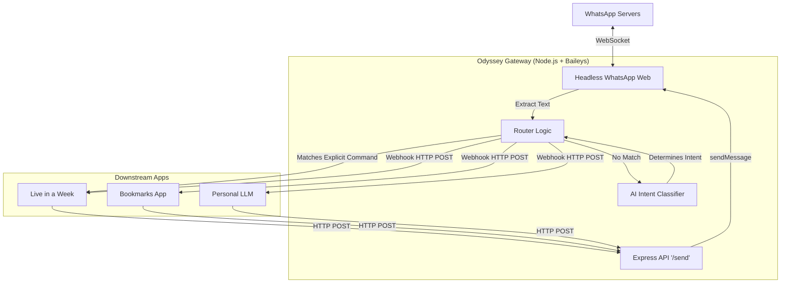

# Odyssey: WhatsApp API Gateway — Implementation Plan

This document outlines the architecture for "Odyssey", a central WhatsApp Bot Gateway built with Node.js and Baileys. It will serve as a unified entry point for all your apps.

## 1. Message Routing Strategy: Hybrid (Explicit + AI Router)
- **Explicit Commands:** Fast and predictable. Messages starting with known prefixes (e.g., `/task`, `/otp`, `/today`) bypass the AI and route directly to the `live-in-a-week` backend.
- **AI Router (Fallback):** Any natural language message (e.g., "Remind me to buy groceries tomorrow" or "What's the weather?") is sent to a lightweight AI Router (e.g., Gemini Flash). The AI evaluates the intent and outputs a JSON response determining which downstream app (Tasks, Personal LLM, Bookmarks) should handle it. The gateway then forwards the message accordingly.

## 2. State & Context Management: Stateless Router
To keep the gateway lightning fast and avoid database overhead:
- **The Gateway is Stateless:** It does not remember past conversations. It simply looks at the *current* message and routes it.
- **Downstream Apps Handle Context:** If you are talking to your Personal LLM, the LLM backend itself will fetch your past messages from its own database to maintain the conversation context.

## 3. Security & Registration: Static JSON Config
A hardcoded `config.json` inside the `odyssey` project will map explicit commands and AI intents to their respective backend webhook URLs.

```json
{
  "apps": {
    "live_in_a_week": "http://host.docker.internal:8000/webhook/whatsapp",
    "bookmarks": "http://host.docker.internal:8002/webhook",
    "personal_llm": "http://host.docker.internal:8003/webhook"
  },
  "explicit_commands": {
    "/task": "live_in_a_week",
    "/today": "live_in_a_week",
    "/week": "live_in_a_week",
    "/done": "live_in_a_week",
    "/otp": "live_in_a_week",
    "/link": "bookmarks"
  }
}
```

## 4. Repository & Setup
The project will be named **Odyssey**, and it will be a completely separate repository with its own `docker-compose.yml` to run the Baileys Node.js client.

### Gateway Architecture


